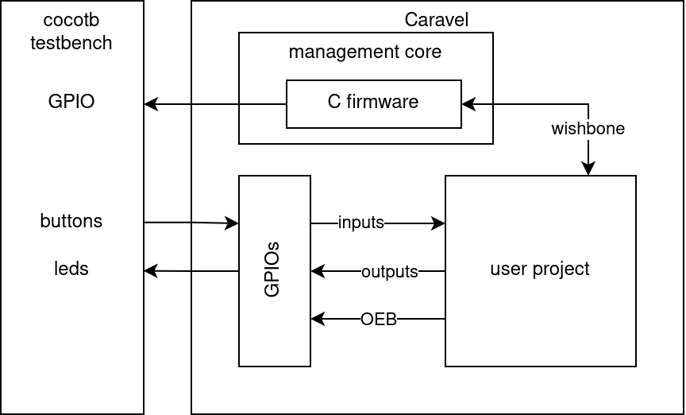
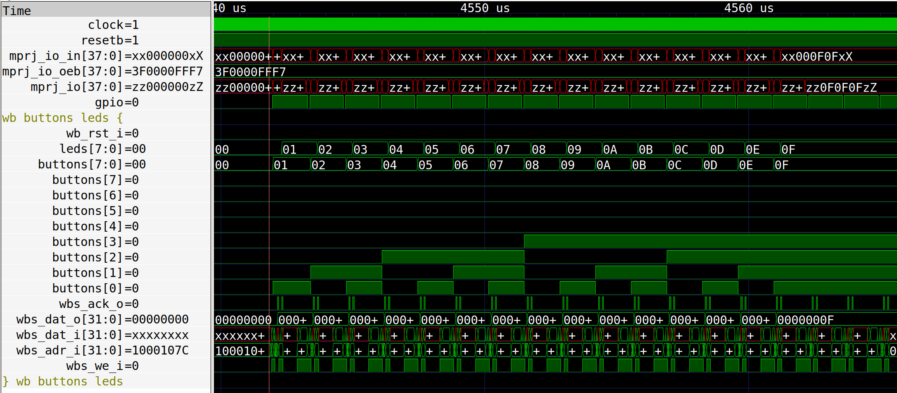

# Caravel Wishbone Demo

Tested with MPW9 Caravel.

## Overview

Caravel has a lot of moving parts and can be confusing. Here's the way things are wired up.

* The cocotb test is [wishbone_test/wishbone_test.py](wishbone_test/wishbone_test.py)
* The C firmware is [wishbone_test/wishbone_test.c](wishbone_test/wishbone_test.c)
* The user project is [wb_buttons_leds.v](wb_buttons_leds.v)

Wiring:

* Buttons are connected on user GPIO 8 to 15
* LEDs are connected on user GPIO 16 to 23
* The firmware also writes to user GPIO 24 to 32 and toggles the single management GPIO

## Test setup

### C firmware

The C [firmware](wishbone_test/wishbone_test.c) sets up the GPIO, enables wishbone and then in a loop:

* reads the buttons via wishbone
* writes that value to the leds via wishbone
* mirrors that value to the GPIO
* toggles the management GPIO to sync with the cocotb testbench

### Cocotb testbench

The [testbench](wishbone_test/wishbone_test.py) waits for GPIO configuration to complete, and then:

* increments the value sent to buttons
* waits for sync by monitoring the management GPIO
* reads the LED output driven by the user project
* reads the GPIO output driven by C firmware
* asserts the LED, GPIO and button value are all the same

## Install instructions

Clone this repository inside `verilog/rtl/`

Instantiate the module inside `user_project_wrapper.v`:

    wb_buttons_leds wb_buttons_leds (
        .wb_clk_i(wb_clk_i),
        .wb_rst_i(wb_rst_i),

        // MGMT SoC Wishbone Slave
        .wbs_cyc_i(wbs_cyc_i),
        .wbs_stb_i(wbs_stb_i),
        .wbs_we_i (wbs_we_i ),
        .wbs_adr_i(wbs_adr_i),
        .wbs_dat_i(wbs_dat_i),
        .wbs_ack_o(wbs_ack_o),
        .wbs_dat_o(wbs_dat_o),

        // IO Pads
        .buttons (io_in [15:08]),
        .leds    (io_out[23:16]),
        .oeb     (io_oeb[23:08])
    );

Include the RTL in the `verilog/includes/includes.rtl.caravel_user_project` file:

    -v $(USER_PROJECT_VERILOG)/rtl/wishbone_buttons_leds/wb_buttons_leds.v

Copy the `wishbone_test` directory to `verilog/dv/cocotb/`

Add the test to `verilog/dv/cocotb/cocotb_tests.py`

    from wishbone_test.wishbone_test import wishbone_test

Install caravel-cocotb: `pip3 install caravel-cocotb`

Run the test:

    caravel_cocotb  -test wishbone_test -tag wishbone_test

You should get a log message like this:

Check the trace:

    gtkwave wishbone_test/wishbone_test.gtkw

It should look like this:

* gpio is going high and briefly low on each loop
* buttons are incrementing - driven by cocotb
* after a delay, leds match the button value
* 2 wishbone acks per loop (read buttons and write leds)

## Formal verification

Requires [Sby with SVA](https://www.yosyshq.com/products-and-services).

    sby -f wb_buttons_leds.sby

To prove wishbone compliance.

## Resources

* Caravel sim infrastructure: https://caravel-sim-infrastructure.readthedocs.io/
* Cocotb: https://www.cocotb.org/
* Management Core: https://caravel-mgmt-soc-litex.readthedocs.io/en/latest/
* Caravel: https://caravel-harness.readthedocs.io/en/latest/
